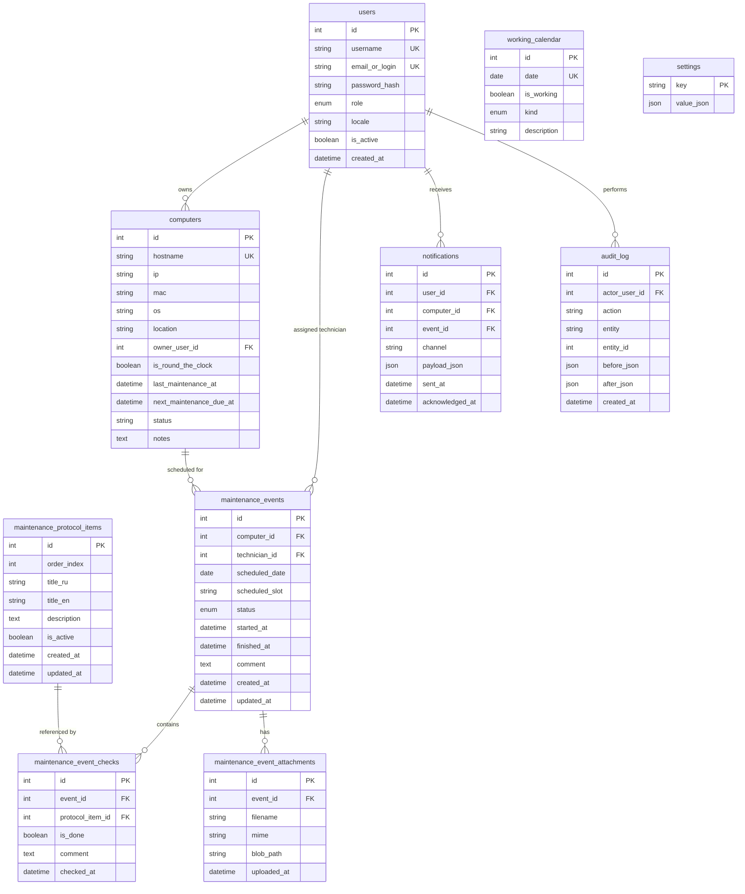

# Computer Fleet Maintenance Scheduler (CFMS)

CFMS is a corporate web application designed for scheduling, executing, and tracking preventive maintenance (ТО) across a corporate computer fleet (~300 devices).

## System Architecture

CFMS is built with a server-rendered web stack and modular architecture:

- **Backend**: Python 3.12, FastAPI, SQLAlchemy 2.0 ORM, Alembic migrations.
- **Frontend**: Jinja2 SSR, Tailwind CSS, HTMX, Alpine.js.
- **Database**: PostgreSQL 16.
- **Network Tools**: `nmap` and `arp-scan` pre-installed in container image.
- **i18n**: Built-in translation engine with Russian (default) and English support.
- **Auth**:
  - Local authentication (Argon2/Bcrypt) for ADMIN, TECHNICIAN, OBSERVER.
  - Signed Magic-Link authentication tokens stored in HTTP-only cookies for end USERS.
  - Pluggable `BaseAuthProvider` pattern with `LocalAuthProvider` and `AdAuthProvider` (LDAP stub).

---

## Default Administrator Credentials

Upon initial database migration (`alembic upgrade head`), a default administrator account is seeded:

- **Username**: `admin`
- **Email / Login**: `admin@cfms.local`
- **Password**: `admin123`
- **Role**: `ADMIN`

*Note: Change the password immediately upon initial deployment in production.*

---

## Helper Scripts

The project includes shell scripts for Docker setup and environment management:

- `run.sh`: Automated local environment setup script. Clones/updates the repository branch, builds Docker containers, and launches services on `http://localhost:8000`.
- `stop.sh`: Gracefully stops running project Docker containers while preserving Postgres volume data (pass `-v` flag to wipe data).
- `install_docker.sh`: Shell script to install Docker Engine and the Docker Compose v2 plugin on Ubuntu.

---

## Features (Iteration 1 & 2)

- **Admin Management**:
  - Full CRUD for Users (ADMIN, TECHNICIAN, USER, OBSERVER) with active/inactive toggling.
  - Full CRUD for Computers with IP, MAC, OS, location, owner assignment, and 24/7 (RTC) flags.
  - Technicians directory view.
- **Excel Fleet Import**:
  - Upload `.xlsx` fleet spreadsheet with preview & validation.
  - Validates hostnames, matches user owners by username or email, handles existing record updates, and highlights errors/warnings before final commit.
- **Audit Logging**:
  - Automatic `audit_log` records for all mutating operations (user/computer creation, edit, toggle, deletion, and Excel import).
- **Working Calendar**:
  - `working_calendar` table pre-seeded with 2025–2026 Belarus working days, weekends, and public holidays (`holiday` kind).

---

## Database Schema



---

## Quickstart & Deployment

### Running with Docker Compose (Production)

Start the PostgreSQL database and FastAPI backend:

```bash
docker-compose up --build -d
```

Access the web interface at `http://localhost:8000`.

### Running with Systemd (Linux Dev / Host Deployment)

1. Copy systemd unit file:
   ```bash
   sudo cp systemd/cfms.service /etc/systemd/system/
   sudo systemctl daemon-reload
   sudo systemctl enable --now cfms.service
   ```

---

## Testing

Run tests using `pytest`:

```bash
# Create virtual environment & install requirements
python3 -m venv venv
source venv/bin/activate
pip install -r requirements.txt

# Run test suite
pytest
```
