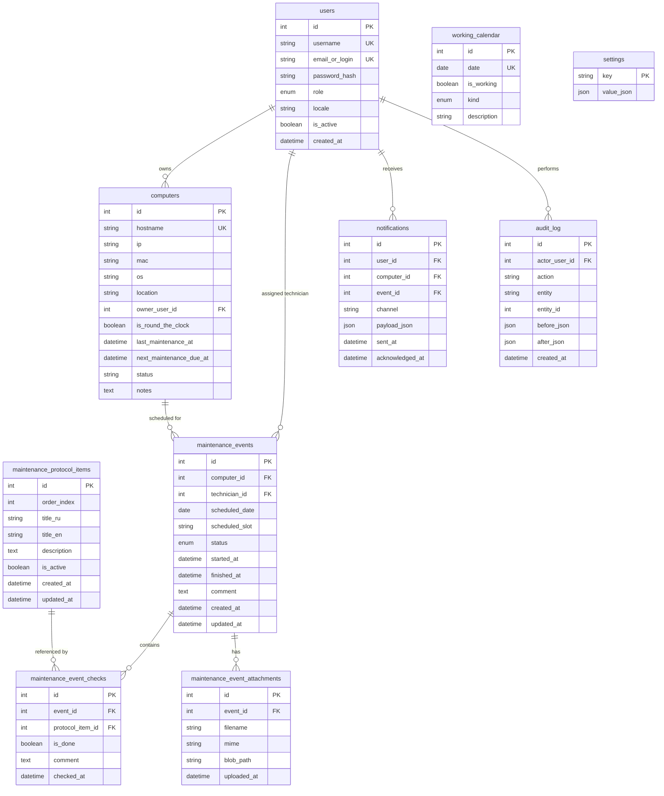

# Computer Fleet Maintenance Scheduler (CFMS)

CFMS is a corporate web application designed for scheduling, executing, and tracking preventive maintenance (ТО) across a corporate computer fleet (~300 devices).

For branch management and contribution rules, see [`CONTRIBUTING.md`](CONTRIBUTING.md) and [`docs/decisions.md`](docs/decisions.md).

## System Architecture

CFMS is built with a server-rendered web stack and modular architecture:

- **Backend**: Python 3.12, FastAPI, SQLAlchemy 2.0 ORM, Alembic migrations.
- **Frontend**: Jinja2 SSR, Tailwind CSS, HTMX, Alpine.js.
- **Database**: PostgreSQL 16.
- **Network Tools**: `nmap` and `arp-scan` pre-installed in container image.
- **i18n**: Built-in translation engine with Russian (default) and English support.
- **Auth**:
  - Local authentication (Argon2/Bcrypt) for ADMIN, TECHNICIAN, OBSERVER.
  - Signed Magic-Link authentication tokens stored in HTTP-only cookies for end USERS.
  - Pluggable `BaseAuthProvider` pattern with `LocalAuthProvider` and `AdAuthProvider` (LDAP stub).

---

## Default Administrator Credentials

Upon initial database migration (`alembic upgrade head`), a default administrator account is seeded:

- **Username**: `admin`
- **Email / Login**: `admin@cfms.local`
- **Password**: `admin123`
- **Role**: `ADMIN`

*Note: Change the password immediately upon initial deployment in production.*

---

## Helper Scripts

The project includes shell scripts for Docker setup and environment management:

- `run.sh`: Automated local environment setup script. Clones/updates the repository branch, builds Docker containers, and launches services on `http://localhost:8000`.
- `stop.sh`: Gracefully stops running project Docker containers while preserving Postgres volume data (pass `-v` flag to wipe data).
- `install_docker.sh`: Shell script to install Docker Engine and the Docker Compose v2 plugin on Ubuntu.

---

## Fleet Import

CFMS supports importing computer inventory from Excel (`.xlsx`) spreadsheets:

- **Download Template Route:** `GET /admin/import/template` (ADMIN role required)
- **Canonical Asset Path:** `app/importer/assets/fleet_import_template.xlsx`
- **Detailed Specification:** See [`docs/fleet-import-format.md`](docs/fleet-import-format.md) for full column contracts, data validation rules, duplicate handling, and boolean/date formats.

---

## Required CI Checks & Code Quality Rules

All pull requests and branch merges must pass the following required CI checks in GitHub Actions:
- **`Run Import Smoke Check` (`import-smoke`)**: Executes `pytest tests/test_import_smoke.py -x -q` to ensure all modules under `app/` are importable without syntax errors and no Python reserved keywords are used as package/module names (see [`docs/decisions.md`](docs/decisions.md)).
- **`Run Ruff Linter & Format Check` (`lint`)**: Executes `ruff check .` and `ruff format --check .`.
- **`Run Pytest Test Suite` (`tests`)**: Executes `pytest` across all unit/integration tests with `--import-mode=importlib`.
- **`Container Smoke Tests`**: Verifies E2E container startup and route health checks in Docker Compose.

---

## Iteration 4 Features & Scope

- **Scheduling Engine (`app/services/scheduling_service.py`)**:
  - Automatic calculation of `next_maintenance_due_at` (every 6 months for RTC / 24/7 computers, every 12 months for non-RTC computers; configurable via `settings`).
  - Active notification window calculation (`selection_window_days`, default 20 days prior to due date).
  - Technician capacity-aware working days filter (`get_available_dates`) integrating the Belarus production working calendar.
  - Window expiry shift logic (`process_unselected_windows` shifts due window 30 days forward if user does not choose a date).
- **User Maintenance Selection & Fleet History Pages**:
  - `/user/my-computers`: List of all assigned computers with metadata (hostname, IP, OS, location), 24/7 status, notification window prompt, planned event status, and full past event history with checklists. Aggregates multiple computers for "Manager" user case.
  - `/user/schedule/{computer_id}`: Date picker form offering selectable future working days where technician capacity exists.
  - Form submission creates/reschedules a `planned` `maintenance_event` assigned to an available technician and logs `create_maintenance_event` or `reschedule_maintenance_event` in `audit_log`.

---

## Iteration 2 Features & Scope

- **Admin User Management**:
  - CRUD for Users across `ADMIN`, `TECHNICIAN`, `USER`, and `OBSERVER` roles.
  - Filtering by role, active/inactive status, and username search.
  - Pagination, column sorting, password reset for local auth roles (`ADMIN`, `TECHNICIAN`), re-issuing magic links for `USER` role, and soft-deactivation.
- **Admin Computer Fleet Management**:
  - CRUD for Computers with fields: `hostname`, `ip`, `mac`, `os`, `location`, `owner_user_id`, `is_round_the_clock`, `last_maintenance_at`, `next_maintenance_due_at`, `status`, and `notes`.
  - Filtering by location, 24/7 (RTC) status, user owner, and search.
  - Strict validations: unique hostname, valid IPv4/IPv6 format, and standard MAC address regex format (`00:11:22:33:44:55`).
  - Single/multi computer ownership ("Manager" virtual property).
- **Technicians Management**:
  - Filtered directory view for `TECHNICIAN` users.
  - Configurable daily maintenance capacity setting per technician (default 1).
- **Excel Fleet Import (.xlsx)**:
  - Downloadable Excel import template (`/admin/import/template`).
  - Spreadsheet parsing and preview table displaying per-row status (`valid`, `warning`, `error`) and diff classification (`new`, `update`, `conflict`).
  - Single-transaction atomic database commit with hard error blocking (rejects whole file when invalid rows exist).
- **Audit Logging**:
  - Every mutating operation (`create_user`, `update_user`, `deactivate_user`, `reset_password`, `reissue_magic_link`, `create_computer`, `update_computer`, `delete_computer`, `update_technician_capacity`, `excel_import_fleet`) records actor ID, entity, entity ID, and before/after JSON states into `audit_log`.

---

## Database Schema



---

## Quickstart & Deployment

### Running with Docker Compose (Production)

Start the PostgreSQL database and FastAPI backend:

```bash
docker-compose up --build -d
```

Access the web interface at `http://localhost:8000`.

### Running with Systemd (Linux Dev / Host Deployment)

1. Copy systemd unit file:
   ```bash
   sudo cp systemd/cfms.service /etc/systemd/system/
   sudo systemctl daemon-reload
   sudo systemctl enable --now cfms.service
   ```

---

## Testing

Run tests using `pytest`:

```bash
# Create virtual environment & install requirements
python3 -m venv venv
source venv/bin/activate
pip install -r requirements.txt

# Run test suite
pytest
```
